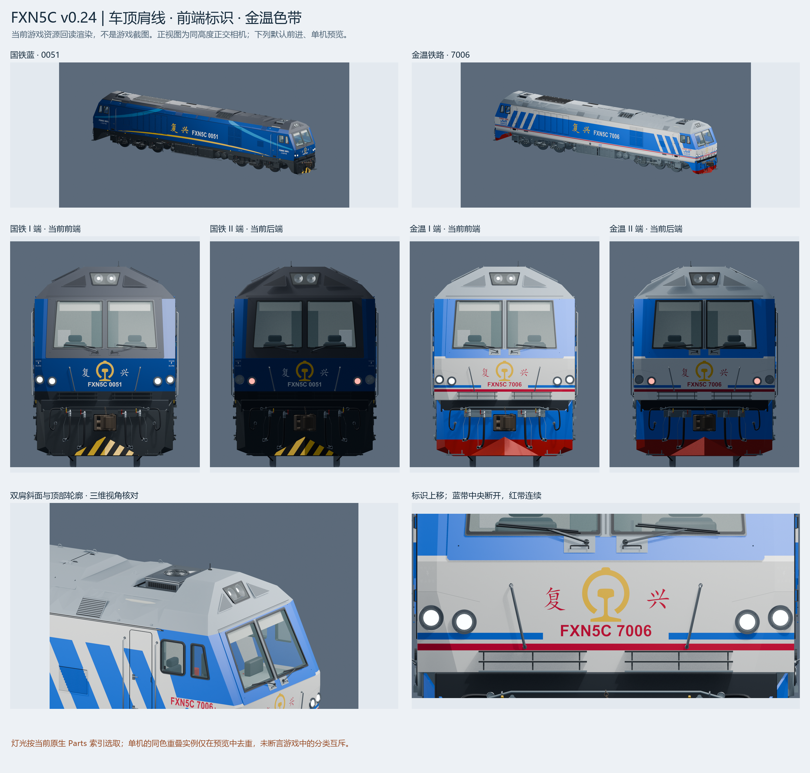

# 复兴5C / FXN5C for Transport Fever 2

国铁蓝与金温铁路涂装，10 个车号。由 Manfredss 发起，使用 AI 辅助建模与脚本开发，持续依据参考资料和游戏反馈修正。

**希望这不只是一个可下载的模组，也是一份能被接着完善的模型。** 欢迎补充实车资料、修正结构、细化转向架，或提交自己的改进。

## 下载与使用

- [版本下载](https://github.com/Manfredss/fxn5c-tpf2/releases)：游戏包及可编辑源文件包，以实际附件为准。
- [创意工坊条目](https://steamcommunity.com/sharedfiles/filedetails/?id=3804171278)：已上传；首次上传后暂处于隐藏／Steam 自动内容检查阶段，可见性以工坊页面为准。
- 游戏使用目录：`source/fxn5c_v24_source/staging/codex_fxn5c_1`。也可直接使用游戏发布 ZIP。
- 请先备份存档，不要同时启用同一模组的本地版和工坊版。

## 内容与游戏参数

| 涂装／配属标识 | 车号 |
| --- | --- |
| 国铁蓝 · 上局沪段 | 0051、0066 |
| 国铁蓝 · 上局宁东段 | 0096、0102 |
| 国铁蓝 · 上局杭段 | 0057、0081 |
| 国铁蓝 · 上局徐段 | 0035、0115 |
| 金温铁路 · 金温温段 | 7005、7006 |

当前游戏配置：3530 kW、580 kN、120 km/h、150 t。默认各年份可购买；可选国铁 2024 年起、金温 2025 年起。配属、年份和参数是本模组设置，不作为实车履历或厂家数据证明。

v0.24 调整了车顶截面、相关设备和灰蓝分界；上移正面标识，修正金温正面蓝带留白、红带贯通；配置按方向切换的红／月白灯光。

## 从模型源文件开始

在 `source/fxn5c_v24_source/` 中打开 `fxn5c_source.blend` 或 `fxn5c_jinwen_source.blend`。两者是可编辑 LOD0 场景，使用 Blender 5.2 保存。贴图另在 `source_textures/`，并已打包入场景。

`fbx_import/` 提供两套涂装各三级 LOD 的静态 FBX；它们不包含完整动画绑定。游戏读取 MDL／MSH，不直接加载 FBX。

脚本是历史增量管线，**不是从最终场景一键导出的通用插件，也还不是已验证的独立可复现构建**。v0.24 构建依赖相邻 v0.23 基线，无缓存重建可能还需 v0.22。必要基线另随 SourceKit 附件提供；具体见 [构建说明](docs/BUILDING.md)。

## 已知不足

- 连接杆仍是双端蒙皮近似，可能弯曲／伸缩，不是精确刚性铰接；极端曲线姿态需要继续检查。
- 隐藏机构、安装关系、轮对与轴箱、管路和转向净空仍欢迎校正；不是厂家 CAD。
- 已完成 v0.24 原生资源和静态配置检查，尚缺本版系统游戏实测记录；渲染预览不能证明游戏灯光分类或编组行为。
- 前端内侧灯按车号固定分配红／白，不宣称对应实车接线。

见 [贡献指南](CONTRIBUTING.md) 和 [更新记录](CHANGELOG.md)。

## 授权

- 原创程序代码：**MIT**，包括商业使用权。
- 原创模型、贴图、资产数据和本项目预览图：**CC BY-NC-SA 4.0**，非商用、署名、相同方式共享。
- 项目说明文档：CC BY-NC-SA 4.0；许可正文和第三方资料遵从各自条款。
- 第三方商标、铁路徽标、字体及参考资料不因本项目而转授权，见 [第三方说明](THIRD_PARTY_NOTICES.md)。

允许在上述许可内修改、重新涂装及公开分享非商用改进版，无需逐次申请；请保留署名、许可链接并标明修改。欢迎回馈改进，但不强制只能在本仓库分享。MIT 代码许可不授予模型商用权。

由于模型有非商用限制，更准确的表述是“开放模型源文件供非商用共创”，而非所有内容均符合开放源代码定义。完整范围见 [LICENSE.md](LICENSE.md)。

## English

An editable FXN5C locomotive project for Transport Fever 2: China Railway blue and Jinwen Railway liveries, ten numbered variants. Contributions to geometry, bogies, linkage motion and in-game testing are welcome. This is an approximate reconstruction, not manufacturer CAD. The incremental build has historical dependencies; see BUILDING.md before running it.

Original code is MIT licensed. Original models, textures and asset data are CC BY-NC-SA 4.0 (noncommercial, attribution, share alike). Third-party marks and materials are excluded from this grant. Preview renders are not in-game screenshots.
